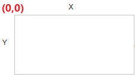

# canvas绘制基础

### 1、概念

* Canvas 中文名叫 “画布”，是 HTML5 新增的一个标签。
* 开发者必须通过 `JS` 才可以在这个标签上绘制各种图案。

### 2、绘制矩形

```html
<canvas id="canvas" width="200px" height="200px"></canvas>

<script>
    // 获取画布
    let canvas = document.getElementById("canvas")
    //获取上下文
    const ctx = canvas.getContext("2d")
    //绘制矩形，从(10,10)坐标开始绘制(x,y)为(100,100)
    ctx.fillRect(10,10,100,100)
    //设置填充颜色
    ctx.fiillStyle="#333"
</script>
```

### 3、坐标系

<figure><figcaption></figcaption></figure>

### 4、路径

#### 4.1  在Canvas上画线，我们将使用以下两种方法：

* moveTo(_x,y_) 定义线条开始坐标
* lineTo(_x,y_) 定义线条结束坐标

```javascript
ctx.moveTo(0,0);
ctx.lineTo(200,100);
ctx.strokeStyle="#ff2d51"
ctx.stroke();
```

#### 4.2  在Canvas上画园

* arc(x,y,r,start,stop)

```javascript
ctx.beginPath()
ctx.arc(95,50,40,0,2*Math.PI);
ctx.closePath();
ctx.stroke();

```

### 5、文本

* font - 定义字体
* fillText(_text,x,y_) - 在 canvas 上绘制实心的文本
* strokeText(_text,x,y_) - 在 canvas 上绘制空心的文本

```javascript
ctx.font="30px Arial"; 
ctx.fillText("Hello World",10,50);
```

### 6、渐变

渐变可以填充在矩形, 圆形, 线条, 文本等等, 各种形状可以自己定义不同的颜色。

以下有两种不同的方式来设置Canvas渐变：

* createLinearGradient(_x,y,x1,y1_) - 创建线条渐变
* createRadialGradient(_x,y,r,x1,y1,r1_) - 创建一个径向/圆渐变

```javascript
// 创建渐变
var grd=ctx.createLinearGradient(0,0,200,0);
grd.addColorStop(0,"red");
grd.addColorStop(1,"white");
// 填充渐变
ctx.fillStyle=grd;
ctx.fillRect(10,10,150,80);
```

### 7、图片

把一幅图像放置到画布上, 使用以下方法:

* drawImage(_image,x,y_)

```javascript
ctx.drawImage(img,10,10);
```
