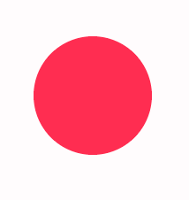
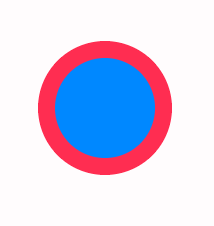

# 绘制动态圆⚪

### 一、绘制单个动态⚪

<figure><figcaption></figcaption></figure>

```javascript
let canvas = document.getElementById("canvas")
const ctx = canvas.getContext("2d")
let radius = 50;
let increase = true;
function draw(){
    //清空画布
    ctx.clearRect(0,0,canvas.width,canvas.height)
    ctx.beginPath();
    ctx.arc(100,100,radius,0,Math.PI*2)
    ctx.closePath();
    ctx.fillStyle = "#ff2d51"
    ctx.fill();
    if(radius<50){
        increase=true
    }else if(radius>100){
        increase=false
    }
    if(increase){
        radius++
    }else{
        radius--
    }
}
setInterval(draw, 20);
```

### 二、绘制多个动态⚪

<figure><figcaption></figcaption></figure>

```javascript
let canvas = document.getElementById("canvas")
const ctx = canvas.getContext("2d")
let radius = 50;
let increase = true;
function draw(){
    ctx.clearRect(0,0,canvas.width,canvas.height)
    ctx.beginPath();
    ctx.arc(100,100,radius,0,Math.PI*2)
    ctx.closePath();
    ctx.fillStyle = "#ff2d51"
    ctx.fill();
    //绘制第二个⚪
    ctx.beginPath();
    ctx.arc(100,100,50,0,Math.PI*2)
    ctx.closePath();
    ctx.fillStyle = "#0088ff"
    ctx.fill();

    if(radius<60){
        increase=true
    }else if(radius>100){
        increase=false
    }
    if(increase){
        radius++
    }else{
        radius--
    }
    setTimeout(draw, 20)
}
draw()
```

&#x20;       **两种动态元绘制分别使用了setTimeout和setInterval方法，如果需要封装的话使用setTimeout方法好点，可以直接在函数内部迭代函数**

