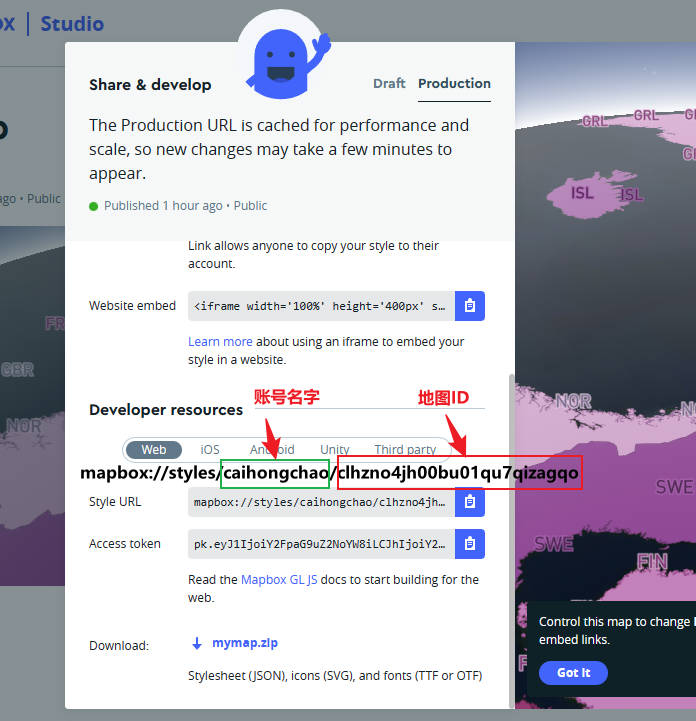

# 2.7 ol添加mapbox影像地图

## 一、加载自定义地图

加载地图的 url 地址可以在下面的这个地址基础上修改对应位置参数即可

* [https://api.mapbox.com/styles/v1/{id}/tiles/{z}/{x}/{y}?access\_token={accessToken}](https://api.mapbox.com/styles/v1/%7Bid%7D/tiles/%7Bz%7D/%7Bx%7D/%7By%7D?access\_token={accessToken}%27)
* {id} 是地图的MapID，需要自己在自定义的地图上查询（点击分享按钮弹出下面的弹窗，MapID即为图上标出来的地方）
* {accessToken} 用户的key，登陆账号后在主界面就可以看到

<figure><figcaption><p>MapID查询</p></figcaption></figure>

```javascript
<div id="mapDiv"></div>

let map = new ol.Map({
  target: "mapDiv",
  layers: [
    new ol.layer.Tile({ 
      source: new ol.source.XYZ({
        url: 'https://api.mapbox.com/styles/v1/mapbox/satellite-v9/tiles/{z}/{x}/{y}?access_token={access_token}',
        attributions: '© <a href="https://www.mapbox.com/about/maps/">Mapbox</a>',
        tileSize: 512,
        maxZoom: 18,
        projection: 'EPSG:3857',
        id: 'mapbox/streets-v11', // Mapbox样式ID
        accessToken: 'access_token' // Mapbox访问令牌
      })
    })
  ]
});
```

## 二、加载mapbox提供的公用图

为了造福用户，Mapbox 提供了很多[示例图层](http://a.tiles.mapbox.com/v3/mapbox/maps.html)。这些图层由名为 `mapbox` 用户发布，下面是几个比较常用的地图ID，加载方法同上，只需要修改地图ID即可

* Mapbox Streets：地图ID为 `mapbox/streets-v11`
* Mapbox Satellite：地图ID为 `mapbox/satellite-v9`
* Mapbox Light：地图ID为 `mapbox/light-v10`
* Mapbox Dark：地图ID为 `mapbox/dark-v10`
* Mapbox Outdoors：地图ID为 `mapbox/outdoors-v11`
* Mapbox Satellite Streets：地图ID为 `mapbox/satellite-streets-v11`
* Mapbox Traffic Day：地图ID为 `mapbox/traffic-day-v1`
* Mapbox Traffic Night：地图ID为 `mapbox/traffic-night-v1`

&#x20;
