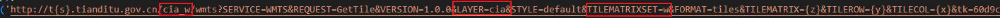

# 2.8 添加天地图影像

天地图官方网站上有下面这句话：

\*天地图地图服务二级域名包括 t0-t7，您可以随机选择使用，如http://t2.tianditu.gov.cn/vec\_c/wmts?tk=您的密钥

所以加载时需要对地址进行编辑。

<figure><figcaption><p>加载其他底图需要修改的参数</p></figcaption></figure>

## 一、ol添加天地图影像

### 1.1 添加墨卡托投影的影像底图

openlayers的默认坐标系就是Web Mercator 投影（EPSG:3857），但是需要注意的一点：

* TILEROW={y}\&TILECOL={x} 官方提供的xy是反着的，我们修改过来，影响就可以正常加载了。

<figure><figcaption><p>加载成功的地址</p></figcaption></figure>

&#x20;      天地图加载可以通过自定义瓦片加载函数来加载，这样类似于leaflet中的 subdomains 参数，具体怎么连接怎么写可以参照加载成功的地址进行修改。在控制台网络里边，观察网络请求地址以及其返回的数据。

```javascript
// 创建自定义的瓦片加载函数
function customTileUrlFunction(tileCoord) {
  var z = tileCoord[0];
  var x = tileCoord[1];
  var y = tileCoord[2];
  var subdomains = ['t0', 't1', 't2', 't3','t4', 't5', 't6','t7']; // 子域列表
  var index = (x + y) % subdomains.length; // 计算子域索引
  var subdomain = subdomains[index];
  return 'https://' + subdomain + '.tianditu.gov.cn/img_w/wmts?service=WMTS&request=GetTile&version=1.0.0&layer=img&style=default&tilematrixset=w&format=tiles&tilematrix=' + z + '&tilerow=' + y + '&tilecol=' + x + '&tk=60d9cd63c3fdc1b359411f6ed31f7795';
}

// 创建地图对象
let map = new ol.Map({
  target: 'mapDiv', // 显示地图的 div 元素的 ID
  layers: [
    new ol.layer.Tile({
      source: new ol.source.TileImage({
        tileUrlFunction: customTileUrlFunction,
        projection: 'EPSG:3857', // 设置投影
      }),
    }),
  ],
  view: new ol.View({
    center: ol.proj.fromLonLat([104,32]), // 设置地图中心点的经纬度坐标
    zoom: 12, // 设置地图缩放级别
  }),
});

```

### 1.2 添加经纬度投影的影像底图

需要设置经纬度，在初始化加载影像时，把投影切换为WGS84 坐标系（'EPSG:4326'）

```javascript
projection: 'EPSG:4326', // 设置投影
```

## 二、leaflet加载天地图

### 1.1 添加墨卡托投影的影像底图

&#x20;      leaflet加载天地图就方便多了，只需要修改地址t0->t{s}  并在参数中在添加一个subdomains参数，值为数组 \[0,1,2,3,4,5,6,7] 即可正常加载。

```javascript
let map = L.map('map',{
	center:[39.6789,116.98765432],
	zoom:15,
	minZoom:1,
});
L.tileLayer('http://t{s}.tianditu.gov.cn/img_w/wmts?SERVICE=WMTS&REQUEST=GetTile&VERSION=1.0.0&LAYER=img&STYLE=default&TILEMATRIXSET=w&FORMAT=tiles&TILEMATRIX={z}&TILEROW={y}&TILECOL={x}&tk=60d9cd63c3fdc1b359411f6ed31f7795', {
	subdomains:[0,1,2,3,4,5,6,7],
	maxZoom: 18,
	maxNativeZoom:18,
	maxZoom:100
}).addTo(map);
```

### 1.2 添加经纬度投影的影像底图

自定义坐标经纬度坐标投影 L.CRS.CustomEPSG4326，设置上去即可

```javascript
L.CRS.CustomEPSG4326 = L.extend({},L.CRS.Earth,{
	code:'EPSG:4326',
	projection:L.Projection.LonLat,
	transformation:new L.Transformation(1/180,1,-1/180,0.5),
	scale:function(zoom){
		return 256*Math.pow(2,zoom-1)
	}
})

let map = L.map('map',{
	center:[39.6789,116.98765432],
	zoom:15,
	minZoom:1,
	crs: L.CRS.CustomEPSG4326
});
L.tileLayer('http://t{s}.tianditu.gov.cn/img_c/wmts?SERVICE=WMTS&REQUEST=GetTile&VERSION=1.0.0&LAYER=img&STYLE=default&TILEMATRIXSET=c&FORMAT=tiles&TILEMATRIX={z}&TILEROW={y}&TILECOL={x}&tk=60d9cd63c3fdc1b359411f6ed31f7795', {
	subdomains: [0, 1, 2, 3, 4, 5, 6, 7],
	maxZoom: 18,
	maxNativeZoom:18, //图层放大到18级别后，再放大重定向请求18级
	maxZoom:100
}).addTo(map);
```

